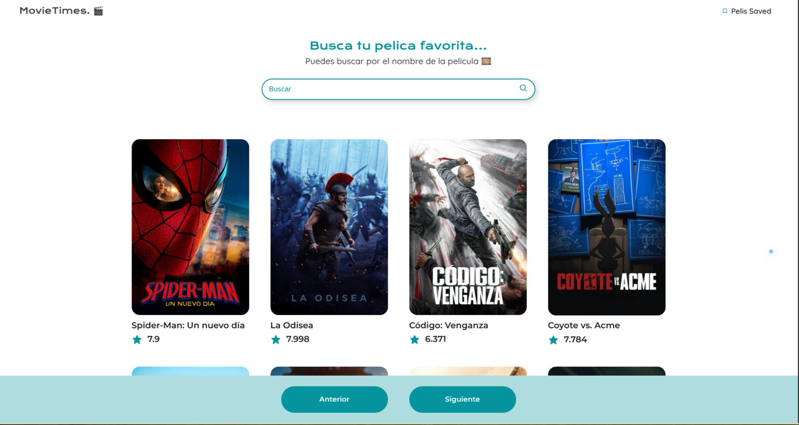

<div align="center">

# 🎬 MovieTime

**Buscá tus películas favoritas en tiempo real.**
Una SPA liviana en JavaScript puro que consume la API de TMDb para explorar el catálogo de películas populares.

[](https://movietim.netlify.app/)


</div>

<br>

<div align="center">
  
</div>

<br>

## 📑 Contenido

- [Sobre el proyecto](#-sobre-el-proyecto)
- [Demo](#-demo)
- [Funcionalidades](#-funcionalidades)
- [Instalación](#-instalación)
- [Cómo está construido](#-cómo-está-construido)
- [Recursos útiles](#-recursos-útiles)
- [Seguridad](#-seguridad)
- [Autor](#-autor)

---

## 📖 Sobre el proyecto

Es viernes a la noche y no sabés qué película ver. Abrís cuatro pestañas distintas, cada una con un catálogo diferente y ninguna búsqueda que realmente filtre mientras escribís.

MovieTime resuelve ese momento puntual: un buscador liviano, sin frameworks, que trae el catálogo de populares de [TMDb](https://www.themoviedb.org/documentation/api) y te deja filtrarlo en tiempo real, con paginación y feedback visual inmediato. Lo construí para dominar de punta a punta el consumo de APIs REST, la manipulación del DOM y el manejo de estado sin librerías — la base sobre la que después construí todo lo demás.

## 🚀 Demo

**[→ movietim.netlify.app](https://movietim.netlify.app/)**

## ✨ Funcionalidades

| | |
|---|---|
| 🔍 | Búsqueda en tiempo real que filtra el listado mientras escribís |
| 🖼️ | Tarjetas de película con póster, título y rating (vote average) |
| ⏭️ | Paginación (anterior / siguiente) sobre el catálogo de populares |
| 🔔 | Notificaciones toast (éxito / error) con Toastify |
| 👀 | El título de la pestaña cambia para llamar la atención cuando salís de la página |

## 🔧 Instalación

```bash
# Cloná el repositorio
git clone https://github.com/Juanma-Alvarado/MovieTime.git
cd MovieTime

# Conseguí tu propia API key gratuita en https://www.themoviedb.org/settings/api,
# copiá config.example.js como config.js (no se commitea, ver Seguridad) y pegala ahí

# Serví el proyecto con cualquier servidor estático, por ejemplo:
npx serve .
# o simplemente abrí index.html en el navegador
```

## 🏗️ Cómo está construido

- **HTML5 + CSS3** — estructura y estilos, sin frameworks de UI.
- **JavaScript (ES6+)** — fetch a la API, renderizado dinámico del DOM, filtrado de búsqueda.
- **[TMDb API](https://api.themoviedb.org/3/movie/popular)** — fuente de datos de películas.
- **[Toastify JS](https://github.com/apvarun/toastify-js)** — notificaciones no bloqueantes.

## 📚 Recursos útiles

- [Documentación de la API de TMDb](https://developer.themoviedb.org/docs)
- [Toastify JS — docs](https://github.com/apvarun/toastify-js)

## 🔒 Seguridad

Este proyecto es 100% frontend (sin backend), así que la API key de TMDb siempre va a ser visible para cualquiera que abra las devtools del navegador — TMDb no ofrece restricción de key por dominio (a diferencia de, por ejemplo, Google Maps), así que no hay forma de ocultarla del todo sin agregar un servidor intermedio.

Por eso vive aislada en `config.js`, que:

- **No se commitea** (está en `.gitignore`) — el repo solo tiene `config.example.js` como plantilla.
- **Se genera en cada deploy de Netlify** a partir de la variable de entorno `TMDB_API_KEY` (ver `netlify.toml`), así que la key nunca queda escrita en el historial de git a futuro.
- Se trata como una **key de demo, de solo lectura, regenerable** desde el [dashboard de TMDb](https://www.themoviedb.org/settings/api) sin tocar el resto del código.

## 👤 Autor

**Juan Manuel Alvarado** — Data Analyst Jr. & Data Scientist Jr.
[GitHub](https://github.com/Juanma-Alvarado) · [Portfolio](https://juanma-alvarado.github.io/PortafolioWeb)
